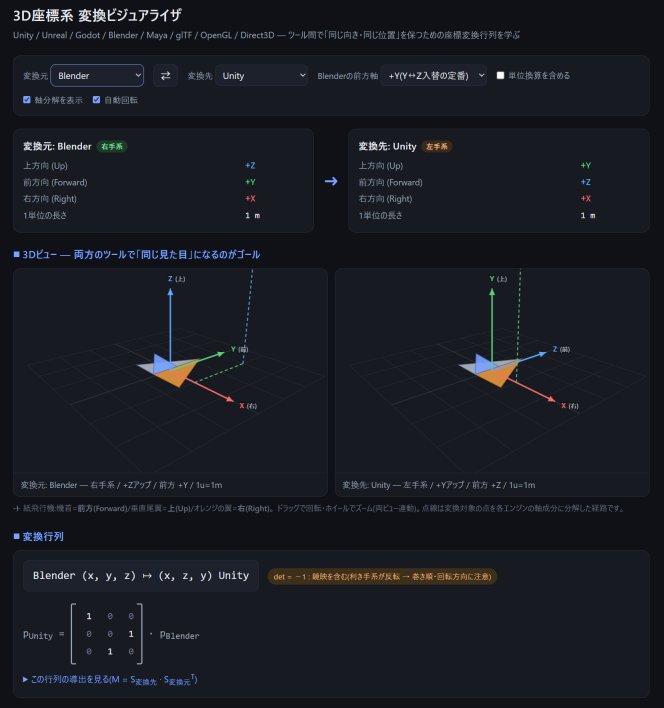

# 3D座標系 変換ビジュアライザ

Unity / Unreal Engine / Godot / Blender / Maya / glTF / OpenGL / Direct3D の間で異なる座標系
(利き手系・上方向・前方向・単位)を、**変換行列の導出過程つき**で学べるインタラクティブな教育用Webアプリです。

外部ライブラリに依存しない**単一のHTMLファイル**で構成されており、ブラウザで開くだけで動作します。

**モデルデータを変換するツールではありません**。座標系の違いを理解するための学習用ツールです。



## Live Demo

https://aike.github.io/3dtr/


## 使い方

`3d-coordinate-converter.html` をブラウザ(Chrome / Edge / Firefox / Safari)で開くだけです。
ビルドやサーバーは不要で、オフラインでも動作します。

## 機能

### 座標系の選択
変換元・変換先のツールをプルダウンで選択します(⇄ボタンで入替)。
各ツールの以下の情報をカードで表示します。

- 利き手系(右手系 / 左手系)
- 上方向(Up)・前方向(Forward)・右方向(Right)の軸
- 1単位の長さ(m / cm)

### 連動する2つの3Dビュー
同じ紙飛行機(機首=前方、垂直尾翼=上、オレンジの翼=右)と変換対象の点を
両方の座標系で描画します。軸のラベルと向きだけが変わり、**見た目は同じになる**ことが
座標変換のゴールであると体感できます。

- ドラッグで回転、ホイールでズーム(両ビュー連動)
- 点線表示で、点を各エンジンの軸成分に分解した経路を可視化

### 変換行列の表示と導出
- 意味方向(右・上・前)を列に並べた基底行列 `S` から `M = S変換先 · S変換元ᵀ` を導出
- `(x, y, z) ↦ (z, x, y)` のような写像式を表示
- `det = −1`(鏡映を含む=利き手系の反転)の場合は、三角形の巻き順・回転方向への影響を警告表示

### 座標の変換例
- 編集可能なカスタム点がリアルタイムに変換され、3Dビューとも連動
- 右・上・前の単位ベクトルが変換先の対応するベクトルに一致することを確認可能
- `x′ = z = 3` のような計算の内訳を表示

### オプション
- **単位換算を含める** — Unreal / Maya(cm系)との変換で必要な倍率(×100 / ×0.01)を
  4×4同次変換行列として表示
- **Blenderの前方軸切替** — +Y(Y↔Z入替の定番)と −Y(正面=−Yの慣習)の両方に対応

## 各ツールの座標系 早見表

| ツール | 利き手系 | 上方向 | 前方向 | 右方向 | 1単位 |
|---|---|---|---|---|---|
| Unity | 左手系 | +Y | +Z | +X | 1 m |
| Unreal Engine | 左手系 | +Z | +X | +Y | 1 cm |
| Godot | 右手系 | +Y | −Z | +X | 1 m |
| Blender | 右手系 | +Z | +Y または −Y | 慣習による | 1 m |
| Maya | 右手系 | +Y | −Z | +X | 1 cm(既定) |
| glTF | 右手系 | +Y | +Z(正面が+Zを向く) | −X | 1 m(仕様で規定) |
| OpenGL / WebGL | 右手系 | +Y | −Z(視線方向) | +X | 任意 |
| Direct3D | 左手系 | +Y | +Z | +X | 任意 |

※ 単位・前方軸は代表的な慣習・既定値です。プロジェクト設定やエクスポート設定により異なる場合があります。

※ three.js は OpenGL / WebGL と、Babylon.js(既定)は Direct3D と同じ慣習です。

※ glTF の「前方 +Z」は**アセットの正面が +Z(カメラ側)を向く**という規約で、
OpenGL の「前方 −Z」(カメラの視線方向)とは意味が逆向きです。そのため本アプリでは
glTF ⇔ OpenGL の変換は恒等行列ではなく上軸まわりの180°回転相当になります
(詳細はアプリ内の解説を参照)。

## 変換行列の考え方

各ツールの座標系は「右(Right)・上(Up)・前(Forward)がどの軸か」で決まります。
意味方向をそのツールの座標で表した列ベクトルを並べた行列 `S = [ R U F ]` を作ると、
変換元 A から変換先 B への変換は

```
M = S_B · S_A⁻¹  ( S は直交行列なので S⁻¹ = Sᵀ )
```

となります。`S` は符号付き置換行列なので、`M` の成分は必ず 0, ±1 のみ——
つまり座標変換の実体は**軸の入れ替えと符号反転**です。

右手系⇔左手系の変換では `det(M) = −1` となり鏡映を含むため、
三角形の巻き順(winding order)の反転や、回転(オイラー角・クォータニオン)の
符号調整が必要になる点に注意してください。姿勢行列 `T` を丸ごと移すときは
`T′ = M · T · M⁻¹` とすれば利き手系の違いも含めて正しく変換できます。

## ライセンス

[MIT License](LICENSE)
